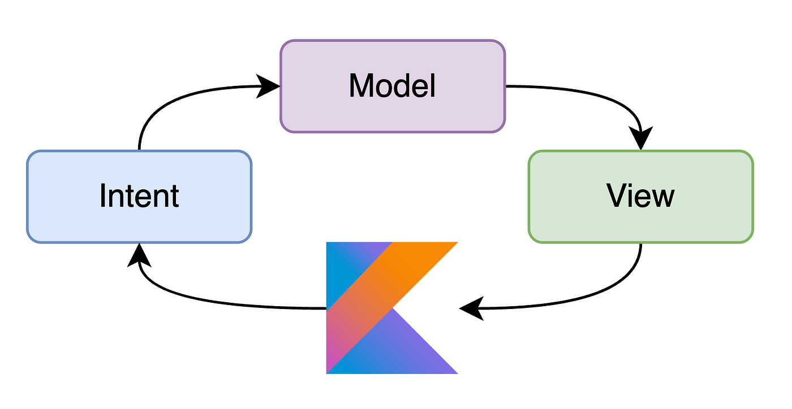

[GitHub](https://github.com/DavidVegaC/Ibk/)

# Informe Técnico: Desarrollo de Aplicación Android

Una mini aplicación bancaria, que se centraliza basicamente en los módulos de inicio de sesión y de consulta de los productos bancarios que posee el usuario.
El objetivo del proyecto es crear una aplicación modularizada utilizando Jetpack Compose, MVVM + MVI y Clean Architecture. Así como el uso de una arquitectura modular, respetando los principios SOLID. Estas decisiones garantizan la escalabilidad, la inyección de dependencias y la realización de pruebas unitarias.

### Screenshots

## Arquitectura y Patrones de Diseño

### Arquitectura MVI

Patron de arquitectura que facilita la construcción de aplicaciones con una estructura clara y predecible, especialmente útil en aplicaciones basadas en UI. MVI se compone de tres componentes principales:

- **Model:**
  Representa el estado de la aplicación y la lógica de negocio. El Model gestiona y almacena los datos y puede realizar operaciones para actualizar el estado.

- **View:**
  Es la interfaz de usuario que muestra el estado actual del Model. La View recibe eventos del usuario e interactúa con el Intent para solicitar cambios.

- **Intent:**
  Define las acciones que el usuario puede tomar o los eventos que ocurren en la aplicación. Los Intents son interpretados por el Model, que actualiza el estado en consecuencia.

### Patrones Utilizados

- **MVI (Model-View-Intent):**  
  Con un flujo unidireccional de datos, los eventos y acciones del usuario siguen un camino predecible, desde la Vista hasta el ViewModel, simplificando las pruebas unitarias y la gestión del estado de la aplicación.

- **MVVM (Model-View-ViewModel):** Este patrón facilita la separación de la lógica de la interfaz de usuario de los datos subyacentes, mejorando la mantenibilidad del código.

## Funcionalidades Destacadas

La aplicación se destaca por:

- **Inicio de Sesión con Biometría:**
  Se implementó la opción de iniciar sesión con la huella, haciendo uso de las librerías de Biometría.

- **Actualización de Datos desde el Servidor:**
  Se implementó el consultar los productos bancarios para el usuario, incluyendo la opción de refrescar la vista.

- **Tiempo de expiración:**
  Se configuró un tiempo de sesión, y pasado el tiempo la sesión se cierra y me redirige a la pantalla de login.

## Seguridad

Se implementaron medidas de seguridad como:

- **Ofuscación de Código:** Configurada para la compilación en modo release, dificultando la comprensión del código descompilado.
- **Inicio de sesión con Biometría:** Inicio de sesión co huella dactilar

## Librerías Utilizadas

La aplicación se basa en las siguientes librerías:

- [**Kotlin**](https://kotlinlang.org/ "https://kotlinlang.org/")

- **[**Jetpack Compose**](https://developer.android.com/jetpack/compose?hl=es-419):** Framework moderno para el desarrollo de interfaces de usuario.

    -   [Compose](https://developer.android.com/jetpack/compose "https://developer.android.com/jetpack/compose")  - Se utiliza para construir interfaces de usuario de manera declarativa.

- **[**Navigation Component**](https://developer.android.com/guide/navigation/migrate) - Gestión eficiente de la navegación, permitiendo el desarrollo de aplicaciones con una sola Activity.

- [**Flow:**](https://kotlin.github.io/kotlinx.coroutines/kotlinx-coroutines-core/kotlinx.coroutines.flow/)  Flow se utiliza para pasar (enviar) un flujo de datos que se pueden calcular de forma asíncrona.

- [**Coroutines:**](https://github.com/Kotlin/kotlinx.coroutines)  Una corrutina es un patrón de diseño de concurrencia que se puede utilizar en Android para simplificar el código que se ejecuta de forma asíncrona.

- **[Koin:](https://insert-koin.io/docs/quickstart/android/)** Librería de inyección de dependencias que reduce el trabajo manual de inserción de dependencias.

- **[Coil:](https://coil-kt.github.io/coil/)** Potente librería para la carga eficiente de imágenes, con almacenamiento en caché para mejorar la velocidad de carga.

- **[Retrofit](https://github.com/square/retrofit "https://github.com/square/retrofit"):** Facilita las peticiones HTTP de manera simplificada.

    - [OkHttp](http://square.github.io/okhttp/ "http://square.github.io/okhttp/") - Un cliente HTTP que sea eficiente por defecto: el soporte para HTTP/2 permite que todas las solicitudes al mismo host compartan un socket.

    - [Gson](https://github.com/square/retrofit/tree/master/retrofit-converters/gson "https://github.com/square/retrofit/tree/master/retrofit-converters/gson") - Se utiliza para convertir objetos Java en su representación JSON y viceversa.

- **[Mockk](https://github.com/mockk/mockk "https://github.com/mockk/mockk"):** Herramientas esenciales para el desarrollo de pruebas unitarias.

-   [**Androidx-core**](https://androidx.tech/artifacts/arch.core/core-testing/ "https://androidx.tech/artifacts/arch.core/core-testing/")  - Allows working with LiveData in order to create dispatcher

- **Gradle Version Catalogs:** Estandariza y facilita la gestión de dependencias en diferentes módulos.

## Conclusiones

El proyecto se desarrolló con un enfoque en las mejores prácticas actuales, priorizando la modularización, seguridad y eficiencia. La implementación de una arquitectura limpia, patrones de diseño claros y medidas de seguridad robustas ha fortalecido la aplicación en términos de mantenibilidad y estabilidad.